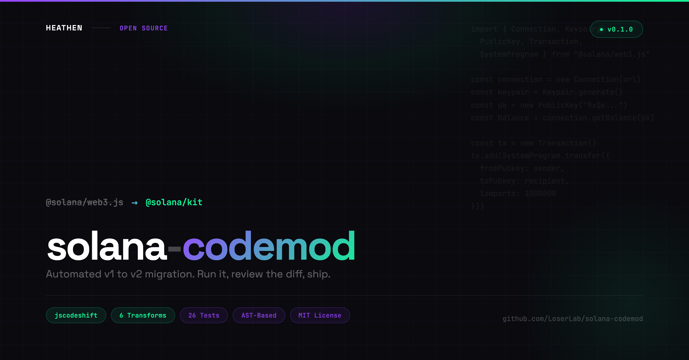

# solana-codemod

<p align="center">
  
</p>

Automated migration from `@solana/web3.js` v1 to `@solana/kit` (v2).

The first open-source codemod for Solana's v1 to v2 migration. jscodeshift-based AST transforms that handle the most common migration patterns. Run it on your codebase, review the diff, clean up the edges.

## Install

```bash
npx solana-codemod ./src
```

Or install globally:

```bash
npm install -g solana-codemod
solana-codemod ./src
```

## What it transforms

| Transform | What it does |
|---|---|
| `public-key-to-address` | `new PublicKey("...")` to `address("...")`, `PublicKey` type to `Address`, removes `.toBase58()`, converts `findProgramAddress` |
| `connection-to-rpc` | `new Connection(url)` to `createSolanaRpc(url)`, appends `.send()` to RPC method calls |
| `keypair-to-signer` | `Keypair.generate()` to `await generateKeyPairSigner()`, `.publicKey` to `.address`, auto-adds `async` |
| `system-program-transfer` | `SystemProgram.transfer` to `getTransferSolInstruction`, renames properties, wraps lamports |
| `transaction-to-pipe` | `new Transaction()` + `.add()` + `.feePayer` to `pipe(createTransactionMessage(...), ...)` |
| `rewrite-imports` | Cleans up `@solana/web3.js` imports, deduplicates `@solana/kit` imports |

Transforms run in sequence. Each is independently runnable.

## Usage

```bash
# Run all transforms
npx solana-codemod ./src

# Run specific transform
npx solana-codemod ./src -t public-key-to-address

# Dry run (no file writes, just show what would change)
npx solana-codemod ./src --dry

# Multiple specific transforms
npx solana-codemod ./src -t public-key-to-address,connection-to-rpc
```

## Before / After

**Before** (`@solana/web3.js` v1):

```typescript
import { Connection, Keypair, PublicKey, SystemProgram, Transaction } from "@solana/web3.js";

const connection = new Connection("https://api.mainnet-beta.solana.com");
const sender = Keypair.generate();
const recipient = new PublicKey("9xQeWvG816bUx9EPjHmaT23yvVM2ZWbrrpZb9PusVFin");

const balance = await connection.getBalance(sender.publicKey);

const ix = SystemProgram.transfer({
  fromPubkey: sender.publicKey,
  toPubkey: recipient,
  lamports: 1000000,
});

const tx = new Transaction();
tx.add(ix);
tx.feePayer = sender.publicKey;
tx.recentBlockhash = blockhash;
```

**After** (`@solana/kit` v2):

```typescript
import { address, createSolanaRpc, generateKeyPairSigner, pipe, createTransactionMessage,
  setTransactionMessageFeePayer, setTransactionMessageLifetimeUsingBlockhash,
  appendTransactionMessageInstruction, lamports } from "@solana/kit";
import { getTransferSolInstruction } from "@solana-program/system";

const connection = createSolanaRpc("https://api.mainnet-beta.solana.com");
const sender = await generateKeyPairSigner();
const recipient = address("9xQeWvG816bUx9EPjHmaT23yvVM2ZWbrrpZb9PusVFin");

const balance = await connection.getBalance(sender.address).send();

const ix = getTransferSolInstruction({
  source: sender.address,
  destination: recipient,
  amount: lamports(1000000),
});

const tx = pipe(
  createTransactionMessage({ version: 0 }),
  (msg) => setTransactionMessageFeePayer(sender.address, msg),
  (msg) => setTransactionMessageLifetimeUsingBlockhash(blockhash, msg),
  (msg) => appendTransactionMessageInstruction(ix, msg),
);
```

## What it doesn't do (yet)

This is an MVP. It handles the most common patterns. You will likely need manual cleanup for:

- `VersionedTransaction` (different from `Transaction`)
- `connection.sendTransaction()` (the v2 signing/sending model is fundamentally different)
- Subscription methods (`onAccountChange`, `onProgramAccountChange`)
- `BN` to `BigInt` conversion (common in Anchor projects)
- Anchor IDL client migration
- `@solana/spl-token` v1 to v2
- Multi-file type tracking (the codemod works per-file)

The codemod gets you 70-80% of the way. Review the output, fix the edges.

## Why migrate?

`@solana/web3.js` v1.x has unpatched vulnerabilities in its dependency chain:

- [CVE-2025-3194](https://github.com/advisories/GHSA-3gc7-fjrx-p6mg) in `bigint-buffer` (CVSS 7.5)
- Multiple CVEs in `elliptic`

`@solana/kit` (v2) has zero third-party dependencies. No transitive vulnerabilities. The Solana Foundation also released [ConnectorKit](https://www.connectorkit.dev/) (`@solana/connector`) as the modern wallet adapter replacement.

## Part of the Solana Migration Toolkit

Four tools that work together to get your project from web3.js v1 to Kit v2:

| Tool | What it does |
|------|-------------|
| [solana-deps](https://github.com/LoserLab/solana-deps) | Trace why legacy packages are in your tree |
| [solana-audit](https://github.com/LoserLab/solana-audit) | Catch CVEs and deprecated APIs that `npm audit` misses |
| **solana-codemod** (this tool) | Auto-migrate code from web3.js v1 to Kit v2 |
| [bigint-buffer-safe](https://github.com/LoserLab/bigint-buffer-safe) | Drop-in CVE fix for bigint-buffer |

**Recommended workflow:** `solana-deps` (find what's legacy) -> `solana-audit` (check for vulnerabilities) -> `solana-codemod` (fix the code) -> `solana-audit` (verify the result).

## Author

Created by **Heathen**

Built in [Mirra](https://mirra.app)

## License

MIT License

Copyright (c) 2026 Heathen
